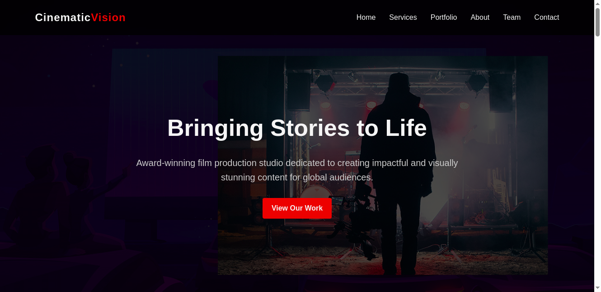
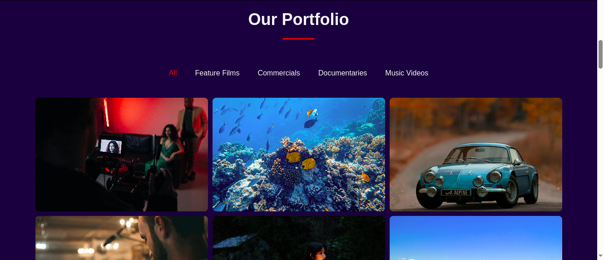
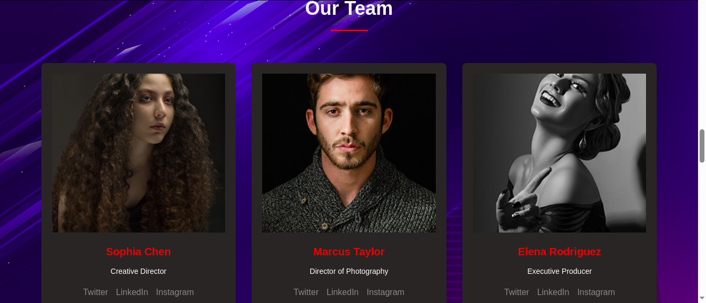

# Cinematic Vision Studios

Cinematic Vision Studios is an award-winning film production company dedicated to creating impactful and visually stunning content for global audiences. This project is a website showcasing the studio's services, portfolio, team, and contact information.

## Table of Contents
- [Features](#features)
- [Technologies Used](#technologies-used)
- [Folder Structure](#folder-structure)
- [How to Use](#how-to-use)
- [Screenshots](#screenshots)
- [License](#license)

---

## Features
- **Hero Section**: A visually appealing introduction to the studio.
- **Services Section**: Highlights the various services offered by the studio.
- **Portfolio Section**: Showcases the studio's work with filtering functionality.
- **Team Section**: Introduces the team members with a link to a detailed team page.
- **Testimonials Section**: Displays client feedback.
- **Contact Section**: Provides contact details and a form for inquiries.
- **Responsive Design**: Fully responsive for desktop, tablet, and mobile devices.

---

## Technologies Used
- **HTML5**: For structuring the content.
- **CSS3**: For styling and layout.
- **JavaScript**: For interactivity (e.g., portfolio filtering).
- **FontAwesome**: For icons (if applicable).

---

## Folder Structure
Here’s a `README.md` file for your project:

```markdown
# Cinematic Vision Studios

Cinematic Vision Studios is an award-winning film production company dedicated to creating impactful and visually stunning content for global audiences. This project is a website showcasing the studio's services, portfolio, team, and contact information.

## Table of Contents
- [Features](#features)
- [Technologies Used](#technologies-used)
- [Folder Structure](#folder-structure)
- [How to Use](#how-to-use)
- [Screenshots](#screenshots)
- [License](#license)

---

## Features
- **Hero Section**: A visually appealing introduction to the studio.
- **Services Section**: Highlights the various services offered by the studio.
- **Portfolio Section**: Showcases the studio's work with filtering functionality.
- **Team Section**: Introduces the team members with a link to a detailed team page.
- **Testimonials Section**: Displays client feedback.
- **Contact Section**: Provides contact details and a form for inquiries.
- **Responsive Design**: Fully responsive for desktop, tablet, and mobile devices.

---

## Technologies Used
- **HTML5**: For structuring the content.
- **CSS3**: For styling and layout.
- **JavaScript**: For interactivity (e.g., portfolio filtering).
- **FontAwesome**: For icons (if applicable).

---

## Folder Structure
```
cinematic_vision/
├── assets/
│   ├── team/               # Team member images
│   ├── testimonial/        # Testimonial images
│   ├── ...                 # Other assets (e.g., portfolio images)
├── css/
│   └── styles.css          # Main stylesheet
├── js/
│   └── script.js           # Main JavaScript file
├── index.html              # Main landing page
├── team.html               # Detailed team page
└── README.md               # Project documentation
```

---

## How to Use
1. Clone the repository:
   ```bash
   git clone https://github.com/your-username/cinematic-vision.git
   ```
2. Open the project folder:
   ```bash
   cd cinematic-vision
   ```
3. Open `index.html` in your browser to view the website.

---

## Screenshots
### Home Page


### Portfolio Section


### Team Page


---

## License
This project is licensed under the MIT License. You are free to use, modify, and distribute this project as per the terms of the license.

---

## Credits
- **Design and Development**: [Kazungu Reagan]
- **Images**: Placeholder images from [Unsplash](https://unsplash.com/) or your own assets.
- **Icons**: [FontAwesome](https://fontawesome.com/)

Feel free to contribute to this project by submitting issues or pull requests!
```

### Notes:
- Replace placeholder text (e.g., `your-username`, `Your Name`) with actual details.
- Add screenshots of your project in the `assets/screenshots/` folder and update the paths in the `Screenshots` section.